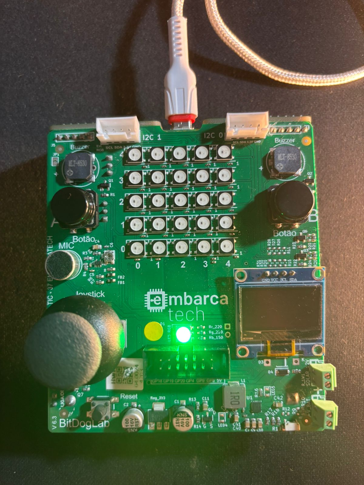
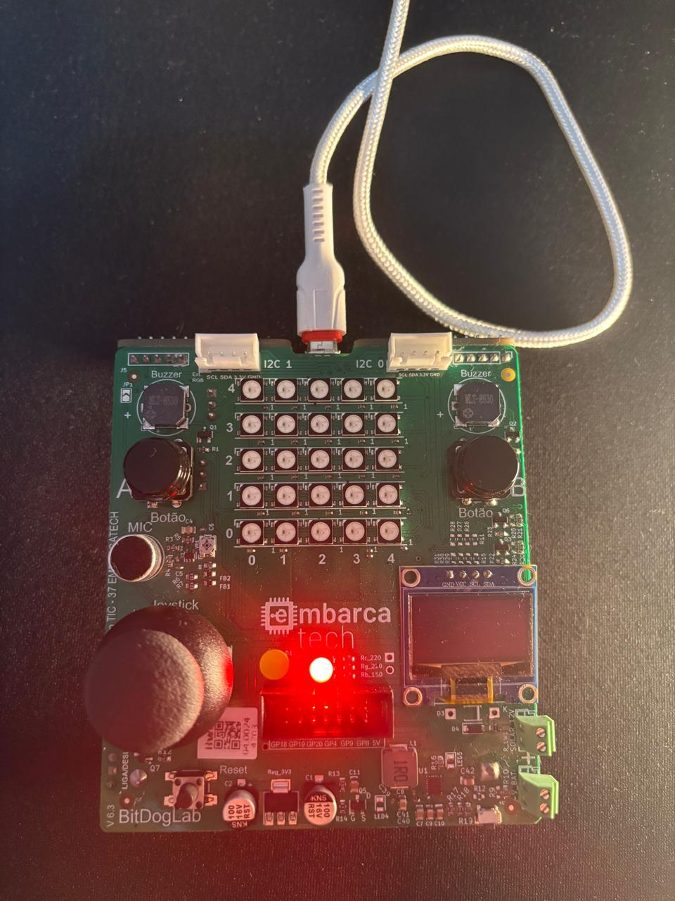
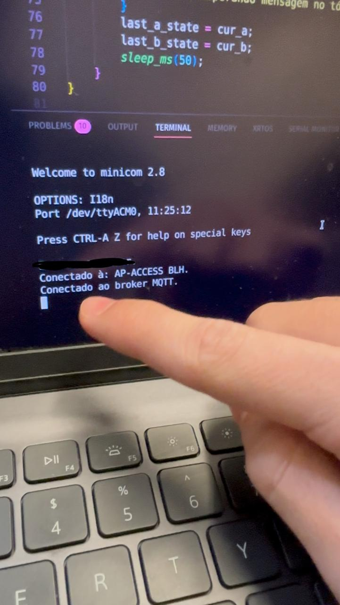
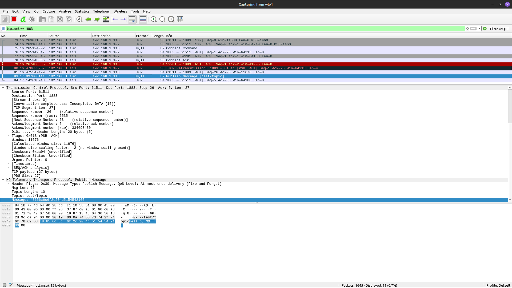
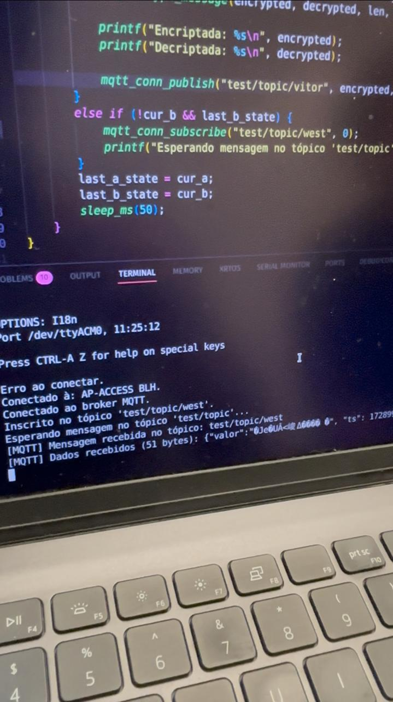
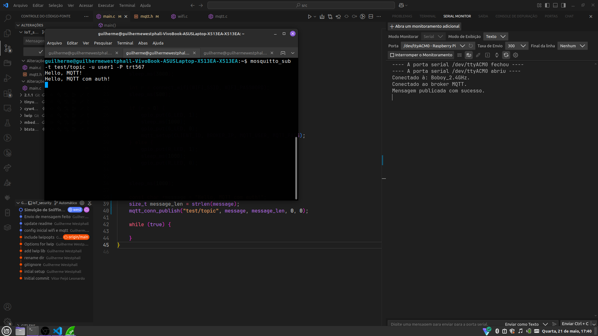
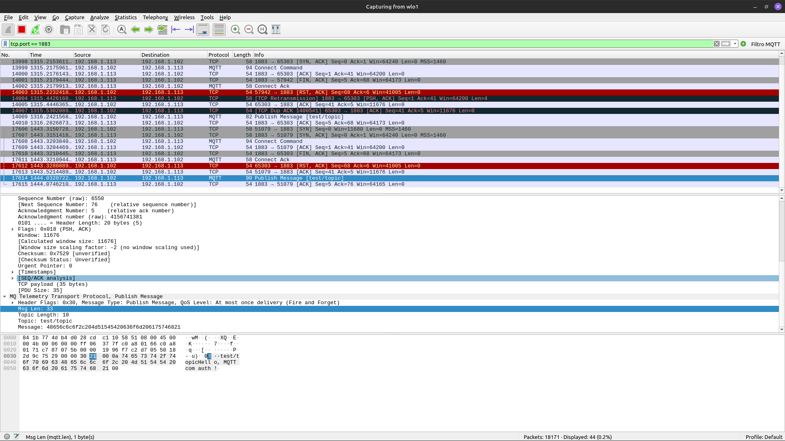
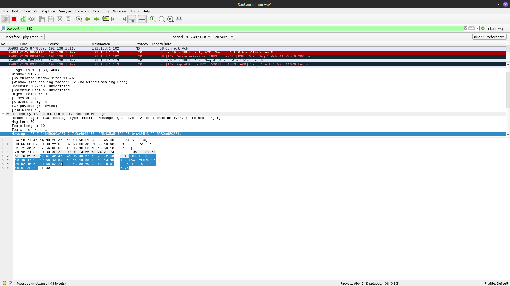

[](https://classroom.github.com/a/G8V_0Zaq)

# Tarefa: IoT Security Lab - EmbarcaTech 2025

**Autores:** Guilherme Westphall & Vitor Feijó </br>
**Curso:** Residência Tecnológica em Sistemas Embarcados </br>
**Instituição:** EmbarcaTech - HBr </br>
📍 Brasília, 04 de junho de 2025

---

## 🎯 Objetivo da tarefa

Desenvolver uma aplicação embarcada em C/C++ com o SDK do Raspberry Pi Pico W, utilizando a plataforma BitDogLab, para estabelecer uma comunicação MQTT segura via Wi-Fi. O projeto inclui a conexão à rede em modo estação (STA), publicação de dados em tópicos MQTT, autenticação com broker Mosquitto, criptografia leve com cifra XOR e mecanismos de proteção contra ataques de sniffing e replay.


## 🛠️ Componentes Utilizados 

| Componente | Descrição | Observações |
| :-: | :-: | :-: |
| **BitDogLab**               | Plataforma embarcada com Raspberry Pi Pico W integrada                           | Inclui Wi-Fi, botões, LED RGB       |
| **Raspberry Pi Pico W**     | Microcontrolador com suporte a Wi-Fi (CYW43439)                                  | Integrado à BitDogLab               |
| **Botão A (GPIO5)**         | Botão físico utilizado para publicação MQTT                                      | Integrado na BitDogLab              |
| **Botão B (GPIO6)**         | Botão físico utilizado para inscrição (subscribe) em tópicos                     | Integrado na BitDogLab              |
| **LED RGB (GPIO11/13)**     | Indica visualmente o status de conexão Wi-Fi (verde = sucesso, vermelho = falha) | Integrado na BitDogLab              |
| **Broker MQTT (Mosquitto)** | Software utilizado como servidor de mensagens MQTT                               | Instalado localmente no notebook    |

## 🗂 Estrutura do Projeto

```
.
├── CMakeLists.txt            # Script de build principal do projeto
├── pico_sdk_import.cmake     # Importação do SDK do Raspberry Pi Pico
├── lwipopts.h                # Configurações personalizadas da pilha lwIP
├── main.c                    # Arquivo principal da aplicação
│
├── inc/                      # Arquivos de cabeçalho (interfaces públicas)
│   ├── aes.h                 # Interface da criptografia AES (extensão)
│   ├── crypto.h              # Interface geral de criptografia (XOR, AES)
│   ├── mqtt.h                # Interface para comunicação MQTT
│   └── wifi.h                # Interface para conexão Wi-Fi
│
├── hal/                      # Implementações de hardware e lógica funcional
│   ├── aes.c                 # Implementação da criptografia AES
│   ├── crypto.c              # Implementação da cifra XOR e abstrações
│   ├── mqtt.c                # Funções de conexão e publicação MQTT
│   └── wifi.c                # Funções de conexão Wi-Fi
```

## Passo a passo para execução do código

1. Faça o clone do projeto:

```bash
git clone git@github.com:EmbarcaTech-2025/tarefa-iot-security-lab-guilherme-e-vitor.git
```

2. Importe a pasta ```SRC``` pela extensão Raspberry Pi Pico.

3. Compile o projeto com o comando:

```bash
mkdir build
cd build
cmake ..
make
```

4. Embarque o .uf2 na BitDogLab:

```bash
cp iot_security.uf2 /media/$USER/RPI-RP2/
```

5. Pronto!

## Relatório 📈

### 📡 Etapa 1 – Conexão Wi-Fi (STA Mode)

Inicialização da conexão Wi-Fi utilizando o SDK do Pico W em conjunto com a pilha de protocolos de rede lwIP. A placa se conecta a uma rede WPA2 por meio do SSID e senha fornecidos, e o status da conexão é indicado visualmente pelo LED RGB: verde indica sucesso e vermelho indica falha. O código está em [wifi.h](./inc/wifi.h) e [wifi.c](./hal/wifi.c).

<p align="center">
  
  
</p>


---

### ☁️ Etapa 2 – Setup MQTT

Conectar as duas BitDogLab ao broker MQTT (Mosquitto), rodando localmente, utilizando o protocolo MQTT. O código de configuração do cliente MQTT está em [mqtt.h](./inc/mqtt.h) e [mqtt.c](./hal/mqtt.c). A configuração, inicialmente, é feita sem autenticação: 

> O arquivo de configuração padrão do mosquitto (/etc/mosquitto/mosquitto.conf) deve estar configurado:

```bash 
listener 1883
allow_anonymous true
```

<p align="center">
  
</p>

### 📤 Etapa 3 – Publicação sem Segurança

Enviar mensagens, em texto claro (sem criptografia), para um tópico específico usando o botão A. Observar os pacotes usando o [Wireshark](https://www.wireshark.org/) e verificar a vulnerabilidade de **sniffing**. O código de publicação está em [mqtt.c](./hal/mqtt.c).

<p align="center">
  
  
</p>

---

### 🔒 Etapa 4 – Autenticação no Broker

Adicionar autenticação simples no broker e configurar no cliente para restringir o acesso apenas a dispositivos autenticados. Inclui configuração do arquivo de senhas e do broker.

> comando para criar o arquivo de senhas e adicionar um usuário (use a flag `-c` para criar o arquivo, ou seja, apenas na primeira vez  que usar o comando)

```bash
sudo mosquitto_passwd -c /etc/mosquitto/passwd nome_do_usuario
```
> Configure as permissões de leitura e escrita no arquivo de configuração do mosquitto `/etc/mosquitto/acl` e atualize o arquivo  `/etc/mosquitto/mosquitto.conf` para usar o arquivo de senhas e ACL

```bash
# acl
user #nome_do_usuario#
topic read/write #nome_do_topico#

# mosquitto.conf
allow_anonymous false
password_file /etc/mosquitto/passwd
acl_file /etc/mosquitto/acl
```

<p align="center">
  
  
</p>

---

### 🔐 Etapa 5 – Criptografia Leve (XOR)

Implementar criptografia leve para proteger as mensagens enviadas via MQTT. Utilizar uma função básica de criptografia, como XOR. O código de criptografia está em [crypto.h](./inc/crypto.h) e [crypto.c](./hal/crypto.c).  

Posteriormente, a criptografia XOR foi substituída por uma criptografia mais robusta, a criptografia AES usando uma biblioteca leve, como [TinyAES](https://github.com/kokke/tiny-AES-c). A criptografia é aplicada antes da publicação e a descriptografia é feita ao receber as mensagens.

<center>

</center>

---

### 🛡️ Etapa 6 – Proteção contra Replay 

Implementar medidas para proteger contra ataques de **replay**, com a inclusão de timestamps. O timestamp é adicionado diretamente no payload da mensagem, na função de publicação [mqtt_conn_publish](./hal/mqtt.c). Ao receber uma mensagem, o cliente verifica se o timestamp é recente (dentro de um intervalo de tempo definido) para evitar a aceitação de mensagens antigas. 

